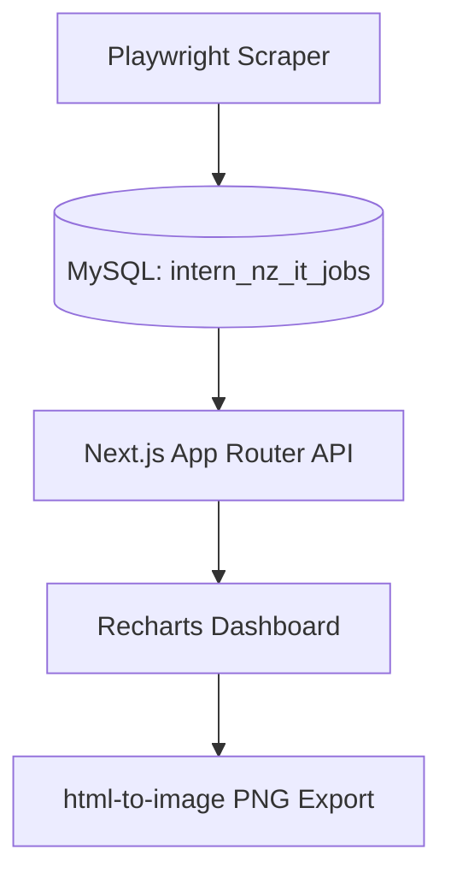

# NZ IT Market Analyzer

新西兰 IT 求职市场洞察工具。  
这个项目围绕奥克兰及全国 IT 岗位，完成从数据抓取、清洗入库、统计分析到海报导出的完整链路，目标是每天产出可分享的就业市场快照。

## 为什么做这个项目

作为开发者和求职者，单看招聘网站很难快速判断市场趋势，比如：

- 哪些技术关键词在最近更热（React、Next.js、SQL、AWS）？
- IT 岗位近 7 天是增长还是回落？
- 岗位主要集中在哪些细分分类？

本项目将这些分散信息结构化成可视化看板，并生成固定 `1080x1440` 的日报海报，适配社交平台分享。

## 技术架构



- **Frontend**: Next.js App Router + Tailwind CSS + Recharts
- **Backend/API**: Next.js Route Handlers (`/api/stats`)
- **Data**: MySQL (`mysql2/promise` 连接池)
- **Crawler**: Playwright + 数据清洗与去重（标题 + 原始链接）
- **Poster Export**: `html-to-image`（高分辨率 PNG）

## 核心功能

- **数据抓取与更新**
  - 抓取 IT 岗位标题、分类、描述、技术关键词
  - 入库前去重（`title + source_url`）
  - 支持全量重跑与日常增量更新
- **统计分析 API**
  - 技术词频统计
  - 近 7 天岗位增长趋势
  - 类别分布统计
- **可视化看板**
  - 技术热度排行（BarChart）
  - 岗位增长趋势（LineChart）
  - 行业类别占比（PieChart）
- **海报导出亮点**
  - `poster-area` 严格按 `1080x1440` 比例设计（PRD要求）
  - 导出时强制原始分辨率并提高像素比，保证分享清晰度

## 目录结构（关键部分）

```txt
app/
  api/stats/route.ts       # 统计聚合接口
  stats/page.tsx           # 看板与海报导出页面
lib/
  db.ts                    # mysql2 连接池与 queryStats
scripts/
  scraper.ts               # IT 岗位抓取/清洗/入库
```

## 本地运行指南

### 1) 安装依赖

```bash
npm install
```

### 2) 配置环境变量

创建或检查 `.env.local`：

```env
DB_HOST=...
DB_PORT=3306
DB_USER=...
DB_PASSWORD=...
DB_NAME=intern_nz_it_jobs
```

### 3) 抓取并更新数据库

```bash
# 常规更新（增量）
npm run data:update

# 全量重跑（会清空 jobs 再写入）
npx tsx scripts/scraper.ts --reset-jobs
```

### 4) 启动看板

```bash
npm run dev
```

打开 [http://localhost:3000/stats](http://localhost:3000/stats)。

## 每日自动化更新（Cron Job 思路）

面试演示时可说明：项目已预留 `data:update` 脚本，支持平台级定时任务。

### 方案 A：GitHub Actions（每日触发）

在仓库中创建 `.github/workflows/daily-update.yml`：

```yaml
name: Daily Data Update
on:
  schedule:
    - cron: "0 20 * * *" # UTC 20:00 = NZ 次日早晨（按需调整）
  workflow_dispatch:

jobs:
  update:
    runs-on: ubuntu-latest
    steps:
      - uses: actions/checkout@v4
      - uses: actions/setup-node@v4
        with:
          node-version: 20
      - run: npm ci
      - run: npm run data:update
        env:
          DB_HOST: ${{ secrets.DB_HOST }}
          DB_PORT: ${{ secrets.DB_PORT }}
          DB_USER: ${{ secrets.DB_USER }}
          DB_PASSWORD: ${{ secrets.DB_PASSWORD }}
          DB_NAME: ${{ secrets.DB_NAME }}
```

### 方案 B：Linux Cron

```bash
crontab -e
```

示例（每天凌晨 2 点）：

```cron
0 2 * * * cd /path/to/nz-it-market-analyzer && /usr/bin/npm run data:update >> /var/log/nz-it-market-analyzer.log 2>&1
```

## 开发者视角：奥克兰 IT 市场洞察

通过最近数据可以明显看到：

- IT 岗位在特定工作日有集中发布窗口；
- 关键词热度反映企业技术栈偏好（云、数据、全栈方向明显）；
- 以日报海报形式输出，能让求职决策从“体感”变成“数据驱动”。
