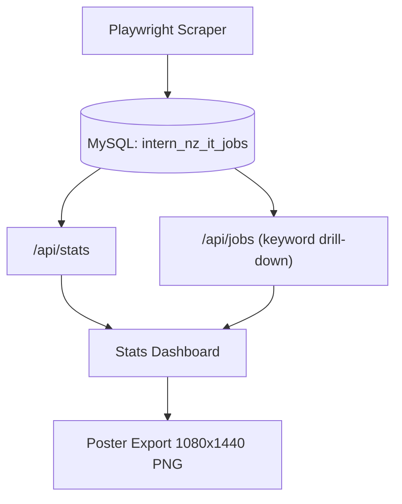

# NZ IT Market Analyzer

A full-stack market intelligence tool for New Zealand IT jobs.  
It collects job data, normalizes and stores records in MySQL, serves analytics through Next.js APIs, and renders a bilingual (Chinese/English) dashboard + exportable poster.

## What It Does

- Crawls IT job listings from `me2link` search data using Playwright
- Deduplicates by `title + source_url` and stores records in `jobs`
- Extracts tech keywords (React, Next.js, Azure, SQL, etc.) from title/category/description
- Exposes analytics API for:
  - tech keyword frequency
  - 7-day posting trend
  - category distribution
- Supports drill-down: click a Top 10 keyword bar to fetch matching job details
- Exports a fixed-size poster (`1080 x 1440`) using `html-to-image`
- Supports poster language toggle (`中文` / `English`)

## Current Architecture



## Tech Stack

- **Frontend**: Next.js App Router, React, Tailwind CSS, Recharts
- **Backend/API**: Next.js Route Handlers
- **Database**: MySQL (`mysql2/promise` pool)
- **Scraping**: Playwright
- **Image Export**: `html-to-image`
- **Language**: TypeScript (strict mode)

## Key Endpoints

- `GET /api/stats`
  - Returns keyword frequency, daily trend, latest publish date/count, category distribution
  - Configured as dynamic and `no-store` to avoid stale analytics
- `GET /api/jobs?keyword=<keyword>`
  - Returns job detail rows for drill-down table
  - Used by Top 10 bar click interaction

## Project Structure (Important Parts)

```txt
app/
  api/
    stats/route.ts          # analytics aggregation endpoint
    jobs/route.ts           # keyword drill-down job details endpoint
  stats/page.tsx            # dashboard, drill-down UI, bilingual poster export
lib/
  db.ts                     # MySQL pool + query helper
scripts/
  scraper.ts                # crawl, clean, dedupe, keyword extract, upsert
.github/
  workflows/
    daily-update.yml        # scheduled scraper workflow
```

## Local Setup

### 1) Install dependencies

```bash
npm install
```

### 2) Configure environment variables

Create `.env.local`:

```env
DB_HOST=...
DB_PORT=3306
DB_USER=...
DB_PASSWORD=...
DB_NAME=intern_nz_it_jobs
```

### 3) Update data

```bash
# Daily/incremental update
npm run data:update

# Full rebuild (truncate jobs first)
npx tsx scripts/scraper.ts --reset-jobs
```

### 4) Run the app

```bash
npm run dev
```

Open: [http://localhost:3000/stats](http://localhost:3000/stats)

## Scraper Notes

- Uses live search API pagination (`total_pages`) to avoid page-cap truncation
- Merges seeds from `job_it_report` (if available) and live search results
- Keeps records even when full description cannot be fetched (uses safe placeholder)
- Backfills missing `listing_date` when possible
- Ensures `jobs` table schema exists before writing

## Daily Automation

The repository includes `.github/workflows/daily-update.yml`:

- Trigger: `cron: "0 20 * * *"` (UTC) + manual dispatch
- Runtime: `ubuntu-latest`
- Timeout: `120` minutes
- Steps:
  1. checkout
  2. setup Node 20
  3. validate required DB secrets
  4. `npm ci`
  5. install Playwright Chromium
  6. run `npm run data:update`

Required GitHub secrets:

- `DB_HOST`
- `DB_PORT` (optional; defaults to `3306` in workflow)
- `DB_USER`
- `DB_PASSWORD`
- `DB_NAME`

## Dashboard Features (Current Version)

- Top 10 keyword bar chart
- 7-day posting trend line chart
- Keyword drill-down job detail table
- Bilingual poster language switch (`中文` / `English`)
- High-resolution PNG export with language-tagged filename
